# IR Cell Spectral Analysis

## Introduction
This project analyzes infrared spectroscopy data from HaCaT (normal) and HeLa (cancer) cells treated with different concentrations of aminopterine in both molecular (AMT) and gold nanoparticle-conjugated (NP) forms. The analysis aims to understand the spectral differences between cell types and their responses to treatments.

## Installation

```bash
pip install -r requirements.txt
```

### Requirements 

Required packages:
- numpy
- pandas
- matplotlib
- seaborn
- scikit-learn
- umap-learn
- torch (for future deep learning implementation)


### Project Structure

IR_cells/
├── data/
│ └── SRmicroFTIR_cellule/
│ ├── HaCaT/ # Normal cells
│ │ ├── AMT/ # Molecular aminopterine
│ │ └── NP/ # Nanoparticle conjugated
│ └── HeLa/ # Cancer cells
│ ├── AMT/
│ └── NP/
├── src/
│ ├── spectral_analysis.py
│ └── spectral_analysis_dim_reduction.py
├── figures/
│ └── dim_reduction/
└── legacy_code/
├── pipeline.py
└── convnext1d.py


## Current Analyses

### 1. Basic Spectral Analysis
- Direct visualization of IR spectra
- Comparison between cell lines and treatments
- Statistical analysis of spectral variations

#### Results

##### HaCaT AMT Comparison
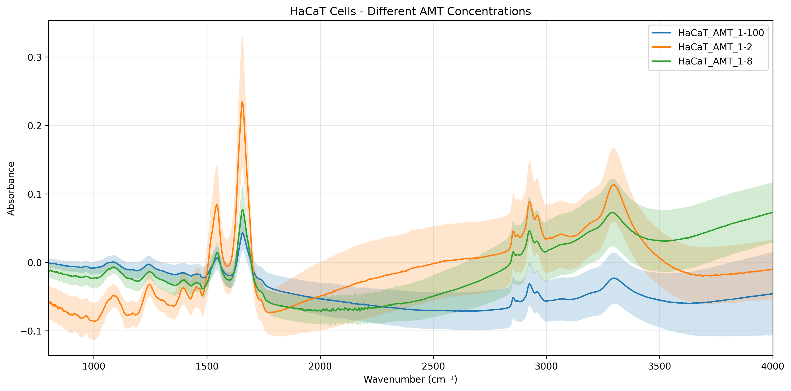
[Discussion needed]

##### HaCaT NP Comparison
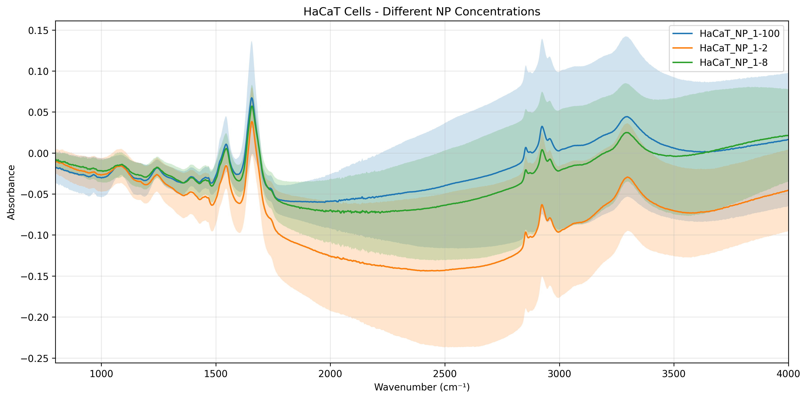
[Discussion needed]

##### HeLa AMT Comparison
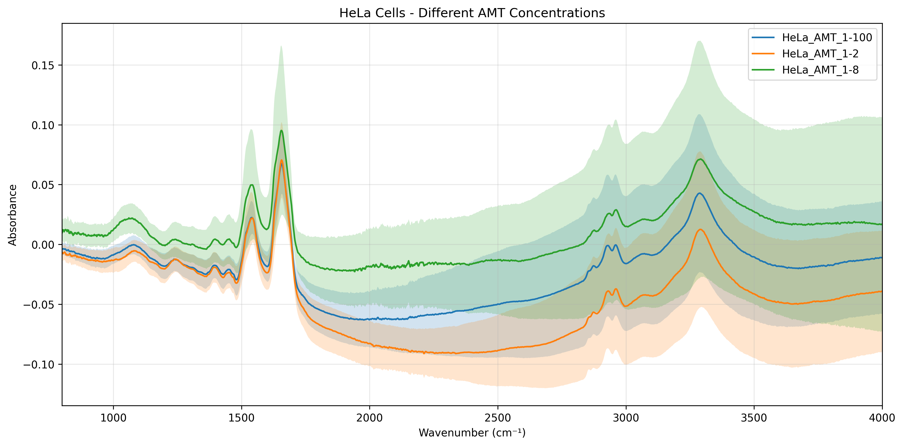
[Discussion needed]

##### HeLa NP Comparison
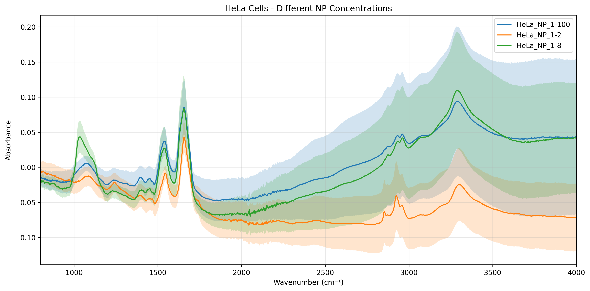
[Discussion needed]

##### All Cell Lines Comparison
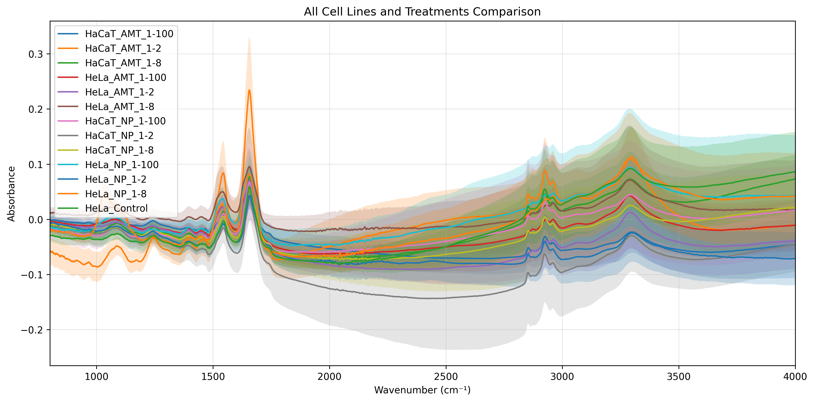
[Discussion needed]

### 2. Dimensionality Reduction Analysis
- Principal Component Analysis (PCA)
- t-SNE Analysis
- UMAP Analysis
- Multiple visualization schemes:
  - By treatment type
  - By cell line
  - By concentration
  - Control vs treated

#### Results
##### PCA Analysis
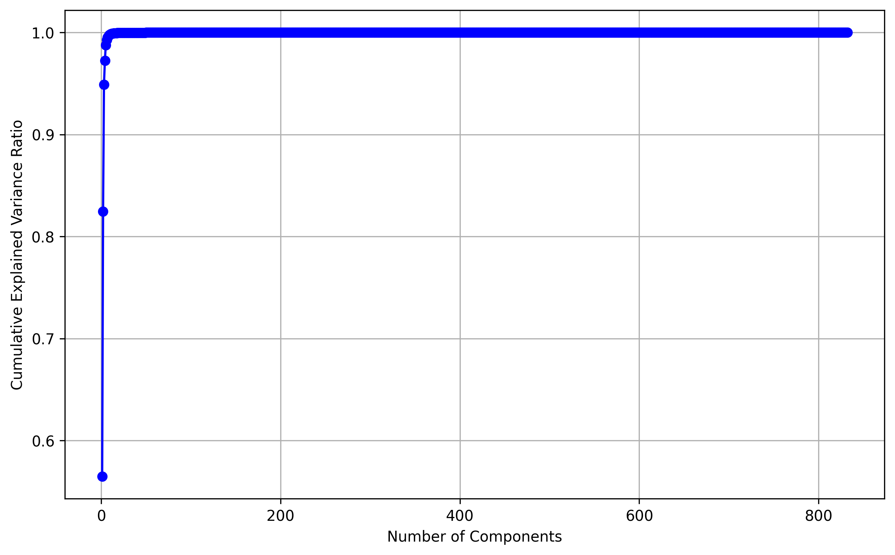
[Discussion needed]

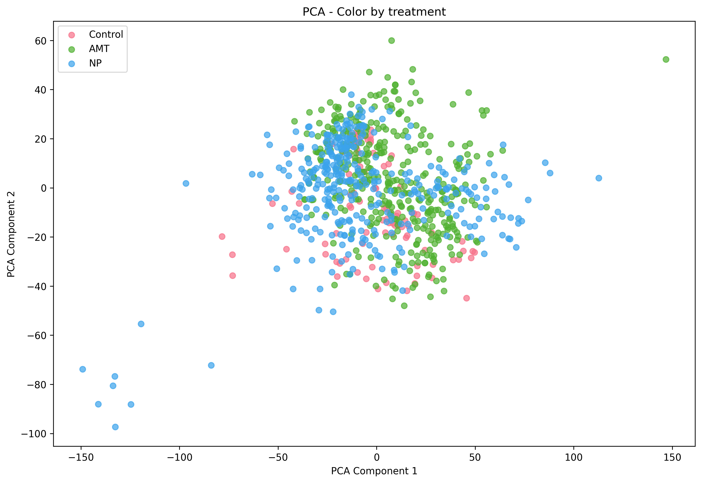
[Discussion needed]

##### t-SNE Analysis
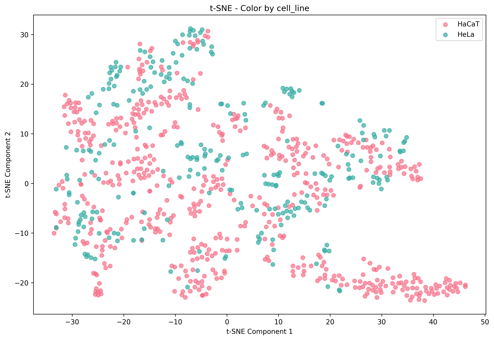
[Discussion needed]

##### UMAP Analysis
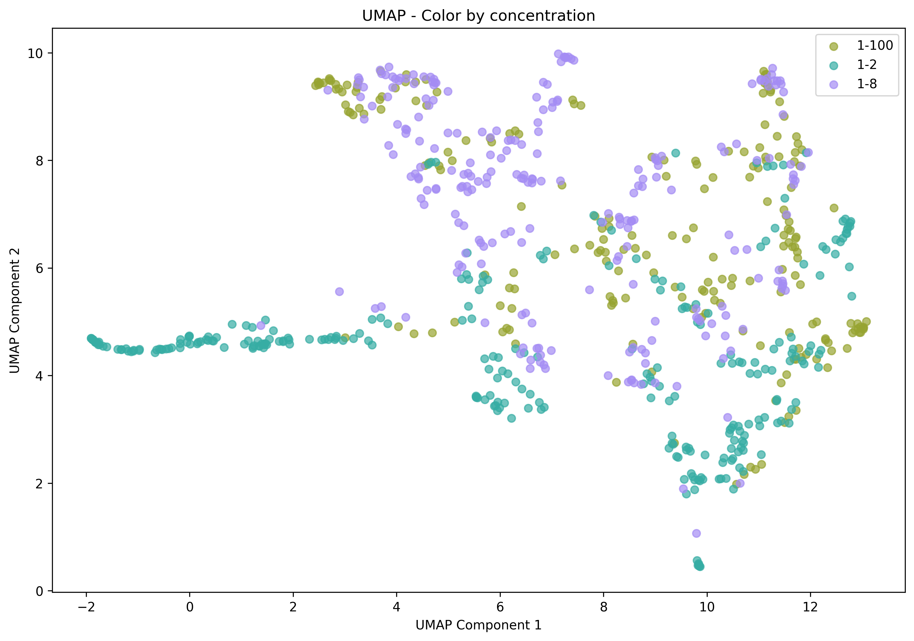
[Discussion needed]

## Development Roadmap

### Current Development
1. Spectral preprocessing pipeline
2. Basic statistical analysis
3. Dimensionality reduction techniques

### Planned Development
1. Implementation of deep learning models:
   - Adaptation of ConvNeXt architecture for 1D spectral data
   - Classification of cell treatments
   - Feature extraction and interpretation

2. Enhanced preprocessing pipeline:
   - Global window resampling
   - Normalization techniques
   - Data augmentation strategies

### Deep Learning Implementation
The project utilizes the ConvNeXt1D architecture for spectral analysis with the following components:

#### Training Pipeline (`trainer.py`)
- Multi-task learning approach:
  - Treatment classification (Control/AMT/NP)
  - Concentration classification (1/2, 1/8, 1/100)
- Training features:
  - AdamW optimizer with weight decay
  - Learning rate scheduling with ReduceLROnPlateau
  - WandB integration for experiment tracking
  - Model checkpointing for best validation loss
- Performance monitoring:
  - Treatment and concentration accuracy
  - Confusion matrices for both tasks
  - Loss tracking for both classification tasks

#### Data Processing (`data_module.py`)
- Automated data loading and preprocessing pipeline
- Preprocessing features:
  - Global window resampling to 1000 points
  - Spectrum normalization
  - Consistent wavenumber range (800-4000 cm⁻¹)
- Data organization:
  - Automatic train/validation split (80/20)
  - Batch processing with DataLoader
  - Label encoding for treatments and concentrations

#### Model Inference (`inference.py`)
- Feature visualization capabilities:
  - Activation mapping across spectral regions
  - Attention visualization for model interpretability
- Batch prediction support
- Integrated preprocessing pipeline

#### Training Results
The model's training performance is demonstrated through the following visualizations:

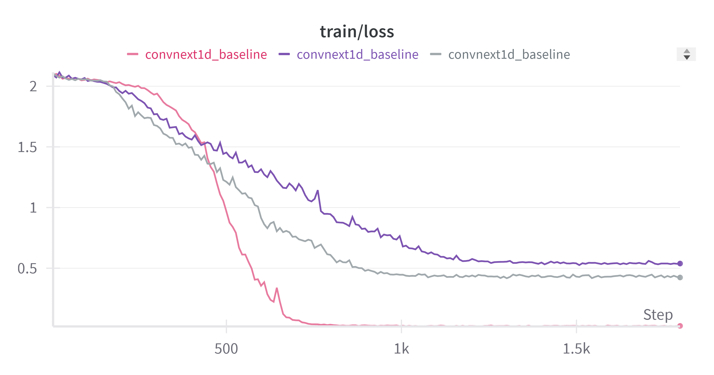

Training metrics showing the model's learning progression over time.

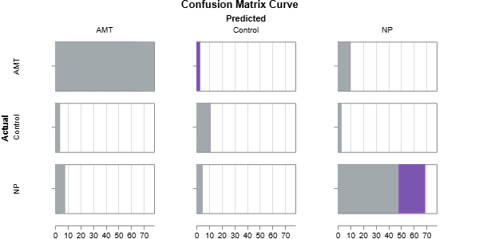
Confusion matrix showing the model's performance in classifying different treatments (Control/AMT/NP).


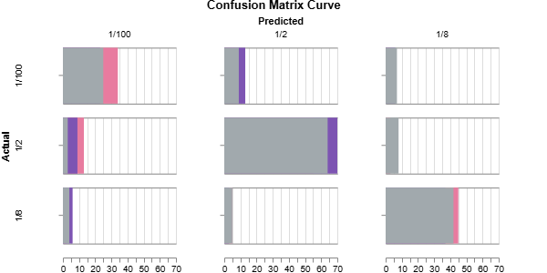

Confusion matrix displaying the model's accuracy in classifying different concentrations (1/2, 1/8, 1/100).


#### Model Analysis
The model demonstrates ability to identify spectral patterns associated with different treatments and concentrations. Example analysis from figures/model_analysis shows the model's attention patterns across the spectral range, highlighting regions of interest for classification decisions.

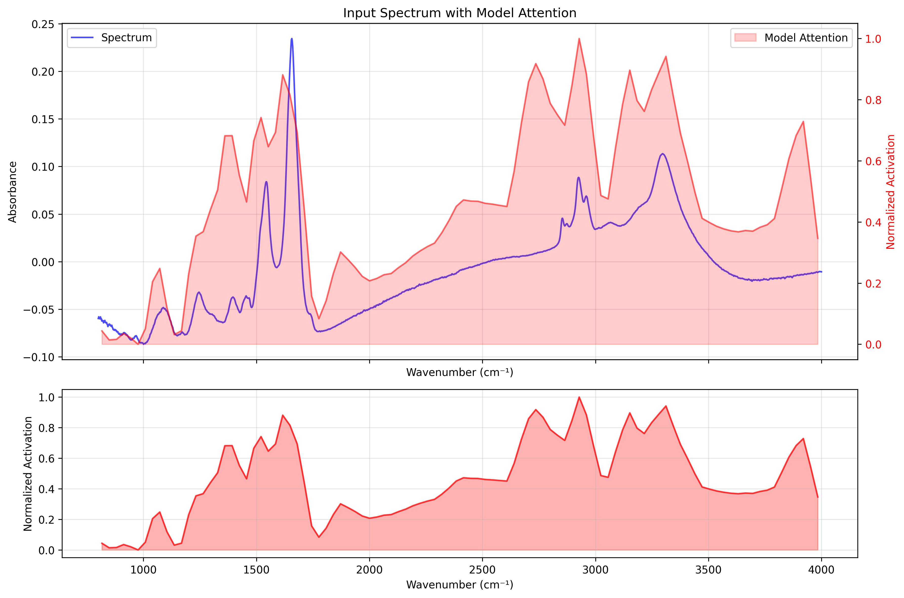
[Discussion needed]

## Usage

### Basic Spectral Analysis
python
from src.spectral_analysis import SpectralData, main
main()

### Dimensionality Reduction Analysis
python
from src.spectral_analysis_dim_reduction import SpectralAnalysis
analysis = SpectralAnalysis("path/to/data")
analysis.run_analysis()
